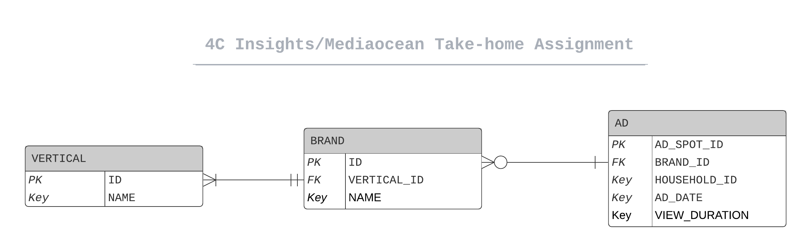

# 4c Insights Take-Home Assignment

## Instructions 

Examine the ``Database Design Exercise (Mediaocean-4C).docx`` document in the root folder

## Entity Relationship Diagram



# Setting Up

## Pre-requisites
- [Python 3](https://www.python.org/)
- [MySQL](https://dev.mysql.com/) - Follow the docs to set up your DB and DB User
 
## Instructions

* Clone repo:

  ```bash
  $ git clone git@github.com:kangaliaisaac/4c-insights-take-home-assignment.git
  ```

* `cd` into the root directory and activate virtualenv

    ```bash
    $ cd /path/to/root/directory/
    $ python3 -m virtualenv venv
    $ . venv/bin/activate
    $ . .env
    ```
  
    In your ``.env`` file export the following variables
    
    ```bash
    #! /usr/bin/bash

    export DB_USER=""
    export DB_PASS=""
    export DB_NAME=""

    ```
 
* Install requirements

    ```bash
    $ pip install --upgrade pip
    $ pip install -r requirements.txt
    ```
